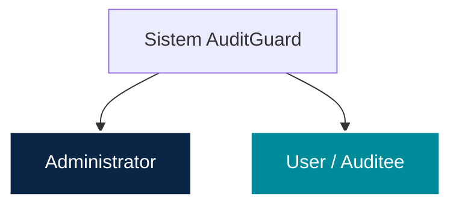
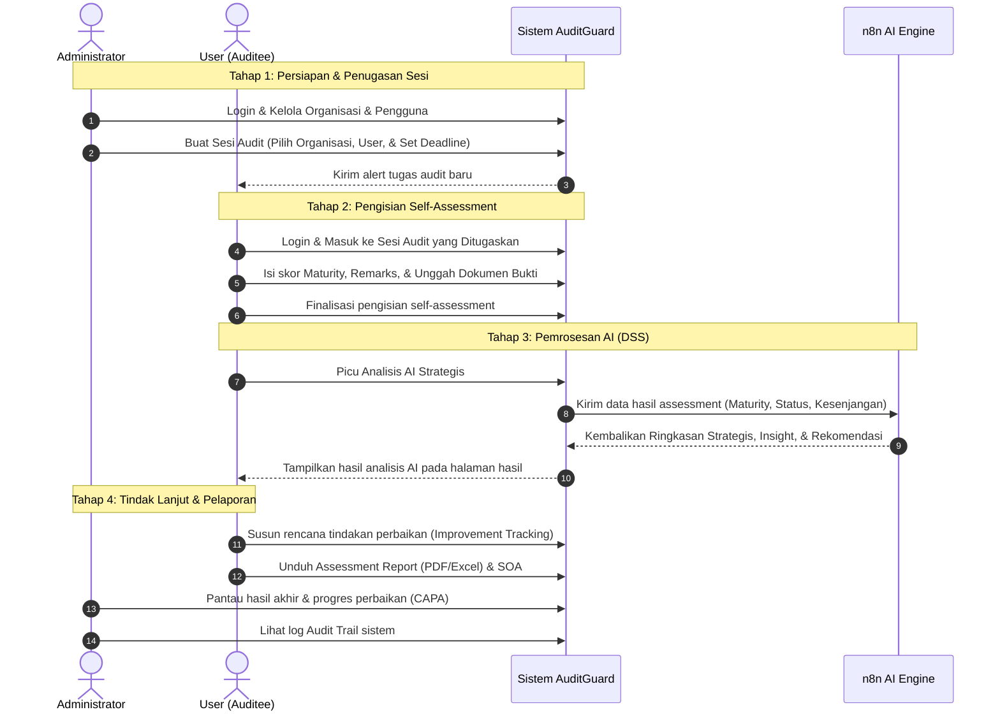

# 4.2 Analisis Pengguna

Analisis pengguna dilakukan untuk mengidentifikasi aktor yang berinteraksi dengan sistem beserta kebutuhan dan hak akses yang dimiliki oleh masing-masing pengguna. **AuditGuard (AI-Assisted Self-Assessment System)** yang dikembangkan merupakan aplikasi berbasis web yang menerapkan mekanisme **Role-Based Access Control (RBAC)** sehingga setiap pengguna hanya dapat mengakses fitur sesuai dengan perannya. Penerapan RBAC bertujuan untuk menjaga keamanan data, mengatur hak akses pengguna, serta memastikan setiap aktivitas dalam sistem dilakukan oleh pengguna yang memiliki otorisasi.

Berdasarkan kebutuhan sistem, terdapat dua aktor utama yang terlibat dalam penggunaan aplikasi, yaitu **Administrator** dan **User**.

---

### 1. Administrator

Administrator merupakan pengguna yang memiliki hak akses penuh terhadap sistem. Administrator bertanggung jawab dalam mengelola data master, organisasi, pengguna, serta menginisiasi pelaksanaan self-assessment melalui pembuatan sesi audit. Selain itu, Administrator memantau hasil assessment, perkembangan tindak lanjut perbaikan, serta aktivitas pengguna selama proses evaluasi berlangsung.

**Kebutuhan Administrator meliputi:**
*   Login ke dalam sistem.
*   Mengelola data organisasi (CRUD).
*   Mengelola data pengguna (verifikasi & manajemen status).
*   Mengelola *Knowledge Base* (panduan implementasi ISO 27001).
*   Membuat dan mengelola sesi audit (menentukan nama sesi, organisasi, pengguna yang ditugaskan, dan deadline).
*   Melihat dan memantau hasil assessment seluruh organisasi.
*   Melihat hasil analisis *Artificial Intelligence* (Executive Summary).
*   Memantau tindak lanjut perbaikan (*Improvement Tracking* / CAPA).
*   Melihat dashboard sistem (statistik & KPI makro).
*   Mengakses dan mengunduh *Assessment Report* (PDF & Excel).
*   Melihat *Audit Trail* (log aktivitas sistem global).

---

### 2. User

User merupakan pengguna yang ditugaskan untuk melaksanakan proses self-assessment berdasarkan standar ISO/IEC 27001:2022 pada sesi audit yang telah dibuat oleh Administrator. User melakukan penilaian terhadap setiap kontrol keamanan informasi yang berstatus *Applicable*, memberikan nilai *Maturity Rating*, melengkapi catatan (*remarks*), serta mengunggah dokumen pendukung (*evidence*) sebagai bukti implementasi kontrol keamanan informasi.

Setelah proses assessment selesai, sistem secara otomatis menghitung *Compliance Score*, *Compliance Status*, *Overall Maturity Score*, *Maturity Level*, *Gap Analysis*, dan *Risk Priority*. Hasil tersebut kemudian dianalisis oleh *Artificial Intelligence* sebagai *Decision Support System* (DSS) untuk menghasilkan *Overall Assessment Summary*, *Control Insight*, *Impact Interpretation*, *Strategic Recommendation*, dan *Action Plan*. Berdasarkan hasil tersebut, User dapat menyusun serta memperbarui tindak lanjut perbaikan (*Improvement Tracking*) sebagai bagian dari upaya peningkatan implementasi Sistem Manajemen Keamanan Informasi (SMKI).

**Kebutuhan User meliputi:**
*   Login ke dalam sistem.
*   Melihat sesi audit yang ditugaskan.
*   Melakukan self-assessment berdasarkan standar ISO/IEC 27001:2022.
*   Memberikan nilai *Maturity Rating* pada setiap kontrol yang berstatus *Applicable*.
*   Menambahkan *remarks* pada setiap kontrol.
*   Mengunggah dokumen pendukung (*evidence*).
*   Melihat hasil assessment (skor kematangan, kepatuhan, & analisis kesenjangan).
*   Melihat hasil analisis *Artificial Intelligence* (Rekomendasi & Ringkasan AI).
*   Mengelola tindak lanjut perbaikan (*Improvement Tracking* / CAPA).
*   Mengakses *Knowledge Base* (panduan referensi implementasi).
*   Melihat dashboard hasil assessment sesi yang ditugaskan.
*   Mengakses dan mengunduh *Assessment Report* (PDF & Excel).

---

### 3. Matriks Otorisasi Hak Akses (RBAC Matrix)

| Modul Fitur | Detail Fungsional | Administrator | User |
| :--- | :--- | :---: | :---: |
| **Autentikasi** | Login / Logout / Reset Password | ✔ | ✔ |
| **Manajemen Pengguna** | Verifikasi pendaftaran, aktivasi/penonaktifan | ✔ | ❌ |
| **Manajemen Organisasi** | Tambah, edit, dan hapus data instansi/organisasi | ✔ | ❌ |
| **Knowledge Base (CRUD)** | Mengelola artikel panduan referensi | ✔ | ❌ |
| **Knowledge Base (View)** | Membaca artikel panduan referensi | ✔ | ✔ |
| **Sesi Audit (Manage)** | Membuat sesi, menetapkan organisasi, user, dan deadline | ✔ | ❌ |
| **Sesi Audit (View)** | Melihat sesi yang ditugaskan / seluruh sesi | ✔ (Semua) | ✔ (Ditugaskan) |
| **Self-Assessment** | Mengisi nilai maturity, remarks, dan unggah bukti | ❌ | ✔ |
| **Analisis AI (DSS)** | Melihat ringkasan strategis AI | ✔ | ✔ |
| **Improvement Tracking** | Memantau & memperbarui tindak lanjut perbaikan (CAPA) | ✔ (Pantau) | ✔ (Kelola) |
| **Assessment Report** | Mengunduh berkas laporan kepatuhan (PDF/Excel) | ✔ | ✔ |
| **Audit Trail (Global)** | Memantau seluruh log aktivitas sistem | ✔ | ❌ |

---

### 4. Diagram Alur Kerja Sistem (Workflow Sequence)

Interaksi antarpengguna dalam pelaksanaan self-assessment terpusat digambarkan dalam diagram urutan berikut:

Analisis pengguna ini menjadi dasar dalam penyusunan kebutuhan fungsional sistem, perancangan *Use Case Diagram*, serta implementasi mekanisme *Role-Based Access Control* (RBAC). Pembagian hak akses tersebut memastikan bahwa Administrator berperan dalam mengelola dan memantau pelaksanaan self-assessment, sedangkan User berfokus pada pelaksanaan assessment dan tindak lanjut perbaikan berdasarkan hasil evaluasi yang dihasilkan oleh sistem.
